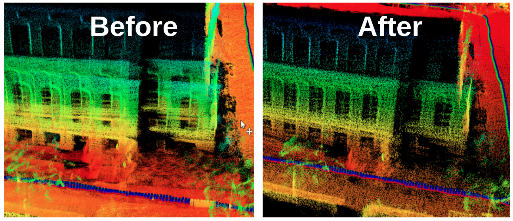
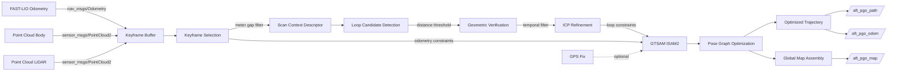
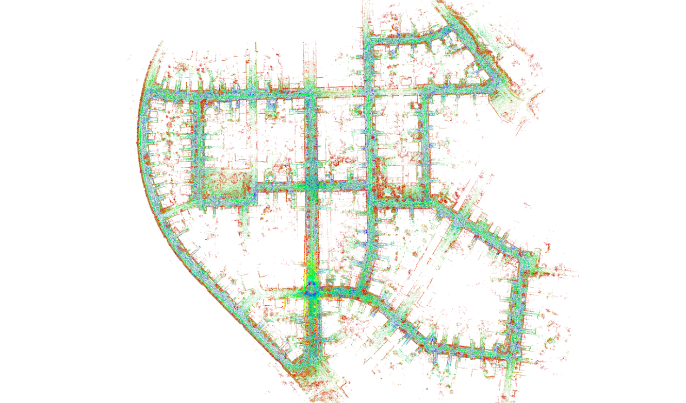
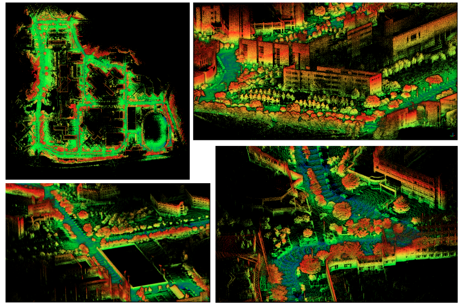
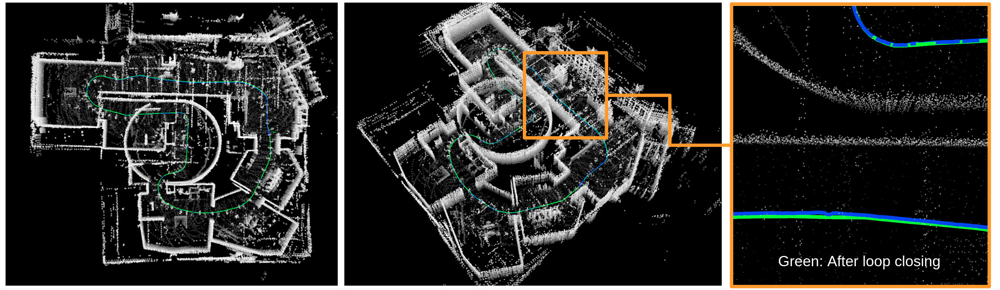

# SC_PGO_ROS2

[](https://docs.ros.org/en/humble/)
[](https://isocpp.org/)
[](LICENSE)

Production-grade ROS2 backend for LiDAR SLAM that performs loop closure detection using Scan Context descriptors and pose graph optimization via GTSAM's ISAM2.
It solves the global drift problem in LiDAR odometry systems by detecting revisited locations and optimizing the full trajectory to produce globally consistent maps.
Designed for roboticists and researchers building autonomous systems with LiDAR sensors, particularly those using FAST-LIO as the frontend odometry source.



## Features

- **Conservative Loop Closure**: Multi-stage filtering (Scan Context → geometric verification → ICP refinement) prioritizes robustness over recall
- **Incremental Optimization**: GTSAM ISAM2 provides efficient incremental pose graph optimization
- **Multi-threaded Architecture**: 6-thread design for concurrent processing, loop detection, ICP refinement, optimization, and visualization
- **Hardware Tested**: Validated on Livox MID-360 LiDAR in real-world environments
- **Optional GPS Integration**: GPS constraints for global reference when available
- **Map Persistence**: Save/load optimized trajectories and point cloud maps

## Architecture

### Data Flow Pipeline



## Requirements

### System Dependencies

- **OS**: Ubuntu 22.04 (tested)
- **ROS2**: Humble Hawksbill
- **CMake**: 3.22 or higher
- **Compiler**: GCC 9+ or Clang 10+ (C++17 support required)

### Core Libraries

- **GTSAM**: 4.0 or higher (pose graph optimization)
- **PCL**: 1.10 or higher (point cloud processing)
- **OpenCV**: 4.0 or higher (Scan Context operations)
- **Eigen3**: 3.3 or higher (linear algebra)
- **Ceres Solver**: 2.0 or higher (ICP cost functions)
- **OpenMP**: Multi-threading support
- **nanoflann**: Included as vendored dependency

### ROS2 Dependencies

```xml
rclcpp, sensor_msgs, nav_msgs, geometry_msgs, std_msgs
tf2, tf2_ros, cv_bridge, pcl_conversions, pcl_msgs
```

### Hardware

- **LiDAR**: Livox MID-360 (tested), or any LiDAR compatible with FAST-LIO
- **Recommended RAM**: 8GB minimum, 16GB+ for large-scale mapping

## Installation

### Install System Dependencies

```bash
# ROS2 Humble (if not already installed)
sudo apt update
sudo apt install ros-humble-desktop

# Build tools
sudo apt install cmake ninja-build

# Core libraries
sudo apt install \
  libpcl-dev \
  libopencv-dev \
  libeigen3-dev \
  libceres-dev \
  libomp-dev

# ROS2 dependencies
sudo apt install \
  ros-humble-gtsam \
  ros-humble-tf2 \
  ros-humble-tf2-ros \
  ros-humble-cv-bridge \
  ros-humble-pcl-conversions \
  ros-humble-pcl-msgs
```

### Build from Source

```bash
# Create workspace
mkdir -p ~/ros2_ws/src
cd ~/ros2_ws/src

# Clone repository
git clone https://github.com/taehun-kmu/SC_PGO_ROS2.git sc_pgo

# Build
cd ~/ros2_ws
colcon build --packages-select sc_pgo --cmake-args -G Ninja

# Source workspace
source install/setup.bash
```

## Usage

### Quick Start

```bash
# Terminal 1: Launch FAST-LIO (frontend odometry)
ros2 launch fast_lio mapping.launch.py

# Terminal 2: Launch SC-PGO (backend optimization)
source ~/ros2_ws/install/setup.bash
ros2 launch sc_pgo sc_pgo.launch.py
```

### ROS2 Topics

#### Subscribed Topics

| Topic | Type | Description | Source |
|-------|------|-------------|--------|
| `/Odometry` | `nav_msgs/Odometry` | LiDAR odometry estimates | FAST-LIO |
| `/cloud_registered_body` | `sensor_msgs/PointCloud2` | Point cloud in body frame | FAST-LIO |
| `/cloud_registered_lidar` | `sensor_msgs/PointCloud2` | Point cloud for Scan Context | FAST-LIO |
| `/gps/fix` | `sensor_msgs/NavSatFix` | GPS measurements (optional) | GPS receiver |

#### Published Topics

| Topic | Type | Rate | Description |
|-------|------|------|-------------|
| `/aft_pgo_odom` | `nav_msgs/Odometry` | 10 Hz | Optimized odometry after PGO |
| `/aft_pgo_path` | `nav_msgs/Path` | 10 Hz | Optimized trajectory |
| `/aft_pgo_map` | `sensor_msgs/PointCloud2` | 0.1 Hz | Global consistent map |

#### TF Frames

- `map` → `aft_pgo` (when `publish_tf: true`)

### Configuration

Key parameters in `launch/sc_pgo.launch.py`:

| Parameter | Default | Description |
|-----------|---------|-------------|
| `scan_line` | 128 | Number of LiDAR scan lines |
| `minimum_range` | 0.5 | Minimum point range (meters) |
| `mapping_line_resolution` | 0.4 | Line feature voxel size (meters) |
| `mapping_plane_resolution` | 0.8 | Plane feature voxel size (meters) |
| `mapviz_filter_size` | 0.05 | Map visualization voxel size (meters) |
| `keyframe_meter_gap` | 0.5 | Distance between keyframes (meters) |
| `sc_dist_thres` | 0.3 | Scan Context distance threshold |
| `sc_max_radius` | 290.0 | Scan Context maximum radius (meters) |
| `save_directory` | `./save_data/` | Output directory for saved maps |
| `publish_tf` | `false` | Publish TF transform |
| `use_current_stamp_for_aft_pgo_odom` | `true` | Use current time for output messages |

### Saving and Loading Maps

Maps and trajectories are automatically saved to the `save_directory` when the node shuts down:

```bash
# Default save location
./save_data/
├── optimized_poses.txt    # Optimized trajectory (KITTI format)
├── odom_poses.txt         # Original odometry (KITTI format)
├── times.txt              # Keyframe timestamps
└── Scans/                 # Individual point cloud scans
    ├── 000000.pcd
    ├── 000001.pcd
    └── ...
```

### Visualization

Launch RViz with the provided configuration:

```bash
rviz2 -d $(ros2 pkg prefix sc_pgo)/share/sc_pgo/rviz_cfg/aloam_velodyne.rviz
```

Key visualization elements:
- Red path: Original odometry trajectory
- Green path: Optimized trajectory after loop closure
- Point cloud: Global map assembly
- Loop closure markers: Detected loop connections

## Project Structure

```
SC_PGO_ROS2/
├── src/
│   ├── laserPosegraphOptimization.cpp    # Main PGO node with 6-thread architecture
│   └── lidarFactor.hpp                   # Ceres cost functions for ICP refinement
├── include/
│   ├── aloam_velodyne/
│   │   ├── common.h                      # Pose6D structure, Euler conversions
│   │   └── tic_toc.h                     # Performance profiling utilities
│   └── scancontext/
│       ├── Scancontext.h                 # Scan Context descriptor generation
│       ├── Scancontext.cpp               # Implementation
│       ├── KDTreeVectorOfVectorsAdaptor.h # Fast nearest neighbor search
│       └── nanoflann.hpp                 # Vendored KD-tree library
├── launch/
│   └── sc_pgo.launch.py                  # ROS2 launch configuration
├── rviz_cfg/
│   └── aloam_velodyne.rviz               # RViz visualization config
├── utils/
│   └── python/
│       ├── makeMergedMap.py              # Offline map merging tools
│       └── pypcdMyUtils.py               # PCD utilities
├── ci/
│   ├── Dockerfile                        # CI environment
│   └── run.sh                            # Docker build script
├── CMakeLists.txt
├── package.xml
└── README.md
```

## Development

### Building with Debug Symbols

```bash
colcon build --packages-select sc_pgo \
  --cmake-args -DCMAKE_BUILD_TYPE=Debug -G Ninja
```

### Running Tests

```bash
colcon test --packages-select sc_pgo \
  --event-handlers console_direct+
```

### Docker CI

```bash
cd ci
bash run.sh
```

## Performance Characteristics

### Computational Complexity

- **Scan Context Generation**: O(N) where N is points per scan
- **Loop Detection**: O(K log K) where K is number of keyframes
- **ICP Refinement**: O(M) where M is points in local map
- **ISAM2 Update**: O(K²) worst case, typically O(K) with good initialization

### Memory Usage

- **Keyframe Storage**: ~10MB per 100 keyframes (point clouds + descriptors)
- **Scan Context Database**: ~1KB per keyframe descriptor
- **GTSAM Factor Graph**: ~100KB per 100 pose nodes

### Real-time Performance

Typical performance characteristics (hardware-dependent):
- Loop detection: 10-20 Hz
- ISAM2 optimization: 1-5 Hz (depends on graph size)
- Overall latency: 50-100ms for keyframe processing

## Contributing

Contributions are welcome.
Please read [CONTRIBUTING.md](CONTRIBUTING.md) for details on the development workflow and coding standards.

### Code Style

- C++17 standard features encouraged
- CPPLINT configuration in `CPPLINT.cfg`
- Maximum line length: 120 characters

### Pull Request Process

1. Fork the repository
2. Create a feature branch (`git checkout -b feature/your-feature`)
3. Follow coding standards and run static analysis checks
4. Write clear commit messages (no AI attribution required)
5. Submit pull request with description of changes

## License

This project is licensed under the BSD 3-Clause License.
See [LICENSE](LICENSE) file for details.

## Acknowledgments

- **Scan Context**: Loop closure method by [Giseop Kim](https://github.com/irapkaist/scancontext)
- **GTSAM**: Georgia Tech Smoothing and Mapping library
- **FAST-LIO**: Fast LiDAR-Inertial Odometry by [HKU-Mars](https://github.com/hku-mars/FAST_LIO)

## Additional Resources

- [Scan Context Paper](https://ieeexplore.ieee.org/document/8593953)
- [GTSAM Documentation](https://gtsam.org/)
- [ROS2 Humble Documentation](https://docs.ros.org/en/humble/)
- [FAST-LIO Repository](https://github.com/hku-mars/FAST_LIO)

## Results

### KITTI Dataset



### KAIST Dataset



### Indoor Environment



### Pipeline Visualization


